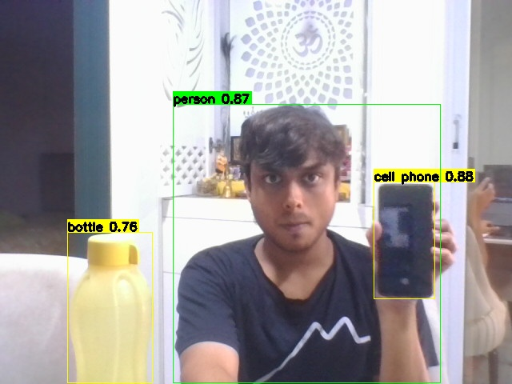

# Real-time Object Detection with YOLOv8

This project implements real-time object detection using YOLOv8 and OpenCV. It captures video from your webcam, performs object detection, and displays the results in real-time with customizable bounding boxes.

## Features

- Real-time object detection using YOLOv8
- Custom bounding box visualization
- Frame capture and saving
- Color-coded detection boxes
- Configurable confidence threshold
- Support for multiple object classes

## Example Output


*Example of real-time object detection with custom bounding boxes*

## Requirements

```bash
pip install ultralytics opencv-python numpy
```

## Usage

1. Place your test images in the `images` folder
2. Run the detection script:
```bash
python yolo_detector/detect_objects.py
```

### Model Download
- The YOLO model will be automatically downloaded when you first run the script
- This ensures you always have the latest version of the model
- The model will be saved in the Ultralytics cache directory

### Controls
- Press 's' to save the current frame
- Press 'q' to quit the application

## Project Structure

```
├── images/                 # Input images folder
├── output_images/         # Output images folder
├── yolo_detector/         # Main code directory
│   └── detect_objects.py  # Main detection script
└── README.md             # Project documentation
```

## Configuration

You can modify the following parameters in `detect_objects.py`:
- `MODEL_NAME`: Choose different YOLOv8 models
  - 'yolov8n.pt' - Nano model (fastest)
  - 'yolov8s.pt' - Small model
  - 'yolov8m.pt' - Medium model
  - 'yolov8l.pt' - Large model
  - 'yolov8x.pt' - XLarge model (most accurate)
- `CONFIDENCE_THRESHOLD`: Detection confidence threshold
- `IMAGE_SIZE`: Input image size for detection

## License

MIT License 